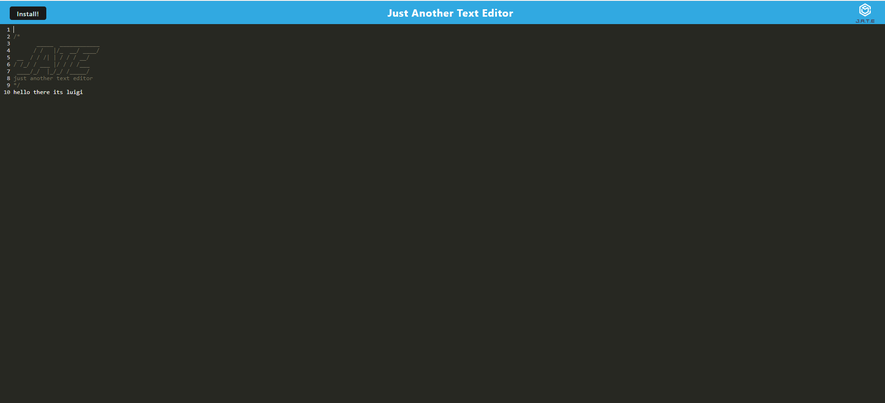
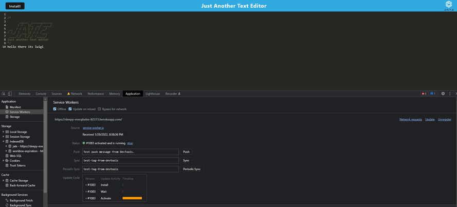

# MVC CMS-style blog site
https://sleepy-everglades-82373.herokuapp.com/

# Description
This is a CMS-style blog site that publishes and edits blog posts as well as making comments on other blog posts.
This comes with full blog editing, login and signup capabilities as well as using session storage to personalize your own profile.

# Table of Contents
* [Installation](#installation)
* [Usage](#usage)
* [Contributions](#contributions)
* [Questions](#questions)

## Installation
### You will need to install the following dependencies prior to running the application: 

No dependencies are required to run this application.

## Usage 
### Below are the following steps required to run this application: 

1. When application is deployed, you will be directed to the the text editor application where you can type in anything and have it saved via indexedDb..

2. Whenever you press the install button, then you are prompted with a confirmation window asking if you want to install the application..

3. After downloading the application, the install button will cease to function but the icon right of the address bar will direct you straight to the application.

4. Once the application is downloaded, you can now open the application on your local computer without prior setup.

5. This application comes equipped with a service worker.

6. This service worker also has offline capabilities.

7. This service will precache all of your assets on pageload.

## Contributions 

No contributions have been made.

## Questions
### If you have a questions or concerns, feel free to contact me at Lsanti618@gmail.com.
